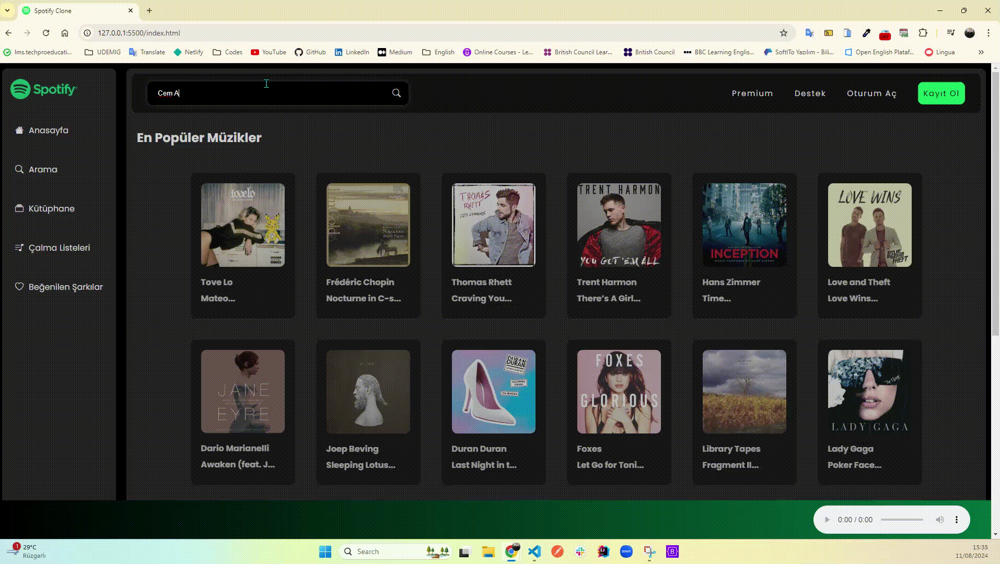
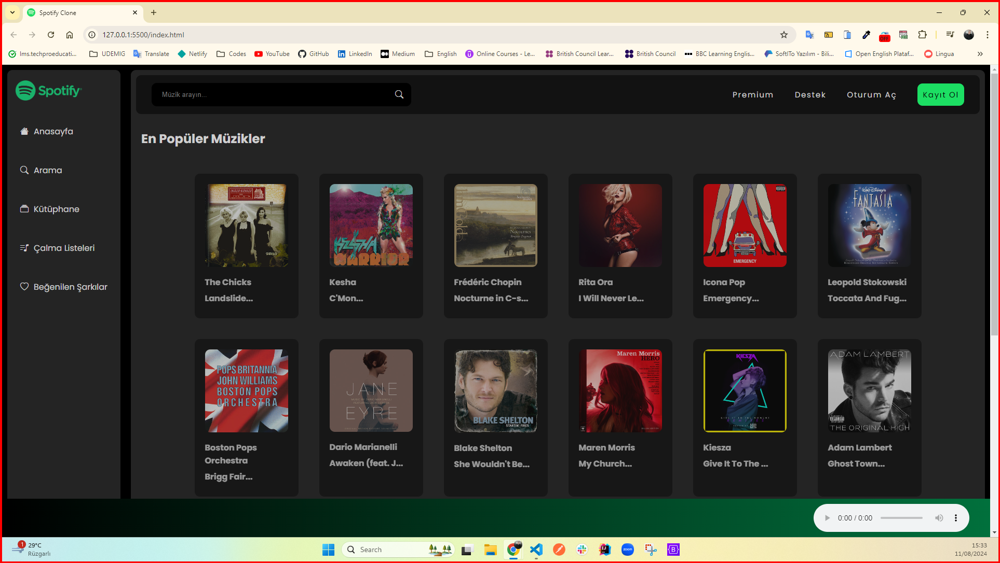
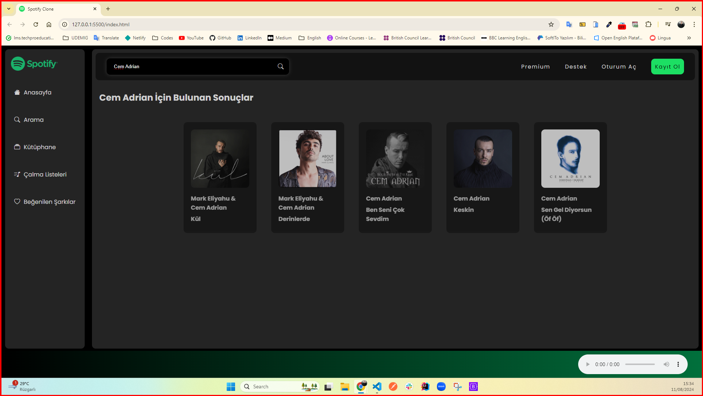
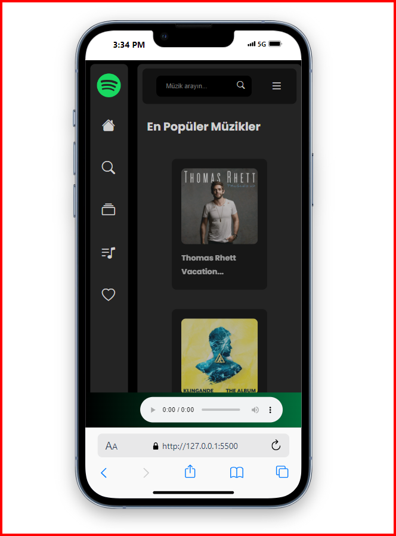

<h1>Spotify Clone Project</h1>

I developed a Spotify Clone project as a web application that includes Spotify's basic features. The project shows popular songs on the homepage. When users click on the songs, the songs start playing. It makes listening to music fun with its rotating cover photos and dynamic interface while the song is playing. It offers interactive features such as song search without any problems thanks to JavaScript and API integration, and users can search for the song they want. Thanks to its responsive design, you can experience the same pleasure on mobile devices.

<h2> The following technologies were used in the frontend development phase of my site: </h2>

- HTML5
- SCSS
- Bootstrap
- API
- Javascript
- Bootstrap Icons

<h4>GIF</h4>

<h3>IMAGES</h3>

